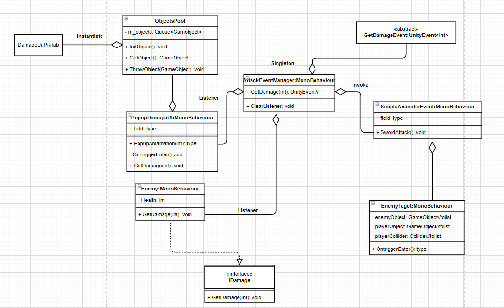
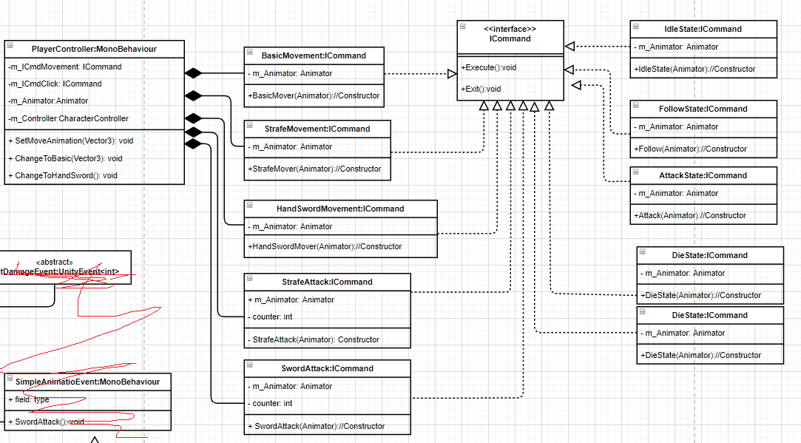
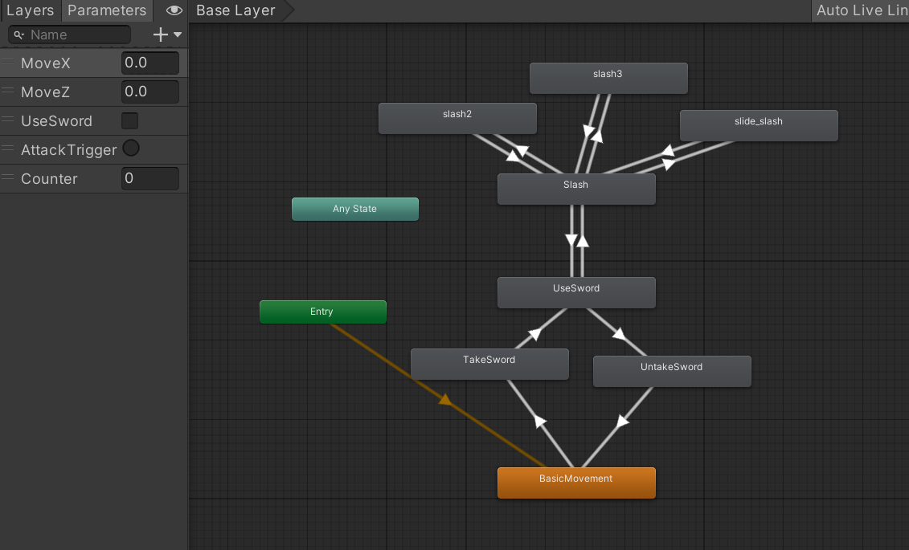
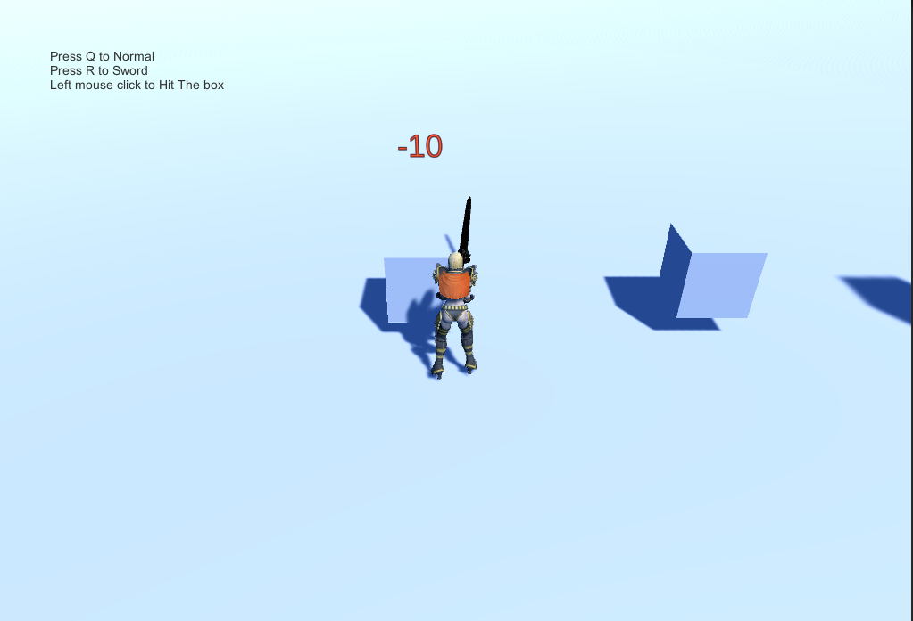

# Unity self programming training
## Class diagram
### Popup diagram
Use Object pool and singleton pattern design

### Movement and Animmation diagram
Use command pattern design

Animmator diagram

## Game Screenshot

## Link to Play
[Play game](https://poppod.github.io/Unity_Self_Programming_Training_HTML5/)